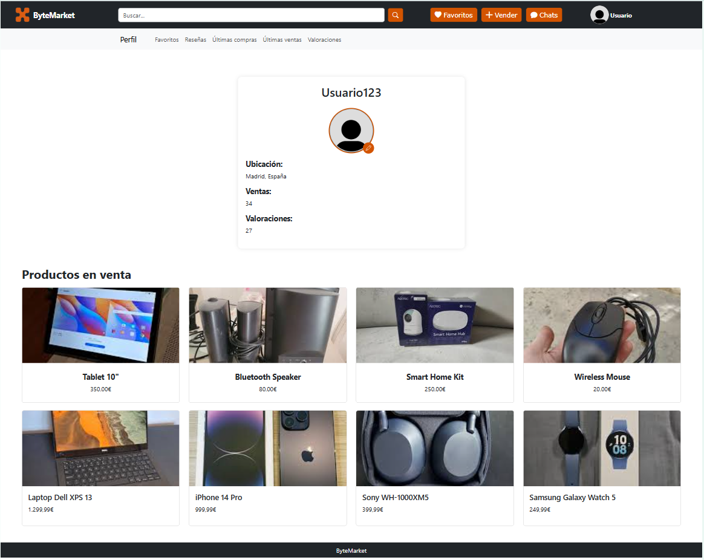

# webapp04

# 
 🌐 ByteMarket 🌐

# 📑Index
- [Phase 0](#-phase-0)
   - [Team members](#-team-members)
   - [Entities](#-entities)
   - [Types of users](#-types-of-users)
   - [User requirements](#-user-requirements)
   - [Additional Technologies](#-additional-technologies)
   - [Charts](#-charts)
   - [Advanced Algorithms](#-advanced-algorithms)
   - [Images](#-images)
- [Phase 1](#%EF%B8%8Fphase-1)
   - [Screens](#screens)

***   
# 🌀 Phase 0
***
 

## 👥 Team members
| Name  | URJC Email| GitHub nickname |
| ------------- | ------------- | ----------- |
| Olga Chubinova Bortsova | o.chubinova.2022@alumnos.urjc.es | [@chubi0l](https://github.com/chubi0l) |
| Marcos García García | m.garciaga.2022@alumnos.urjc.es  | [@marcosgrc](https://github.com/marcosgrc) |
| Naroa Martín Simón | n.martins.2022@alumnos.urjc.es  | [@NaroaMS04](https://github.com/NaroaMS04) |
| Adrián Muñoz Serrano  | a.munozse.2022@alumnos.urjc.es  | [@adri04ms](https://github.com/adri04ms) |

## 👣 Entities
- User
- Product
- Reviews
- Purchase
- Chat
  
 The entities *user* and *product* will have **images** as attributes.
 Moreover, the entitie *user* will have **saved products** as an attribute.
 
 The following diagram shows the system's entities, and how they relate to each other. 
  ##### img: Entity-Relationship Diagram
   

## ⚧️ Types of users

 - **Anonymus** : users who have not logged into a registered account. They can access basic functionalities as viewing products, searching products and filter products.
 - **Registered** :  users who have logged into a registered account. They can access a wide variety of funcionalities like buying, selling, reviewing, saving products they like and also they can message other users.
 - **Admin** :  type of user who has control over the platform, having the most extensive permissions. They are also allowed to ban usual users if they use offensive language or they publish explicit content.
   
## 🔎 User requirements

| Requierement | Anonymus| Registered | Admin |
| ------------- | ------------- | ----------- | --------- |
|   View products  | 
 ☑️ 
 | 
 ☑️ 
 | 
 ☑️ 
  |
|   Search product  | 
 ☑️ 
 | 
 ☑️ 
 | 
 ☑️ 
  |
|   View product details  | 
 ☑️ 
 | 
 ☑️ 
 | 
 ☑️ 
  |
|   View profile information (registered users)  | 
 ☑️ 
 | 
 ☑️ 
 | 
 ☑️ 
  |
|   Create reviews  | | 
 ☑️ 
  | |
|   Save product  | | 
 ☑️ 
  | |
|   Buy product  | | 
 ☑️ 
  | |
|   Sell product  | | 
 ☑️ 
  | |
|   Message seller  | | 
 ☑️ 
  | |
|   Modify profile information  | | 
 ☑️ 
  | |
|   Modify product details  | | 
 ☑️ 
  | |
|   Delete own product  | | 
 ☑️ 
  | |
|   View graphics  | | 
 ☑️ 
  |  |
|   Delete products (from other users)  | | | 
 ☑️ 
  |
|   Delete reviews (from other users)  | | | 
 ☑️ 
  |
|   Delete users  | | | 
 ☑️ 
  |

## 🖱️ Additional Technologies
- **Email**: users will receive emails when their favorite product is sold.
-  **Google Maps**: users could use this aplication to locate the address of the seller (to see if the transportation management is suits them).
  
## 📊 Charts
- **Personal sell chart**: users will be able to visualize a sell chart of the products they have selled throughout the year.
- **Personal buy chart**: users will be able to visualize a buy chart of the products they have buyed throughout the year.

## ⚙️ Advanced algorithms
- **Recommend by best seller**: This algorithm will choose products of the higher-rated seller first.
- **Recommend by favorites**: This algorithm will choose the products to be featured in a registered user's home page based on products the user has saved as "favorite" products.

## 🎯 Images
-  **User profile**: allow users to upload an image to their profile.
-  **Products photos**: allow users to upload images to their products.

***
# 🌀 Phase 1
***

## 🖥️ Screens

### 🏠 Home Screen
This screen will show to whoever the access to webpage. This image represents the anonymus user's header (depending on the user, the header will change), from which you can either login or sign up. Also, any user have access to view the details of the products. 

| User | Admin | Anonymous |
| :----: | :------: | :------: |
|  |  |  |

###  🎮 Product detail Screen
Screen showing information about the product for sale (price, description) and the user selling it. It also offers the possibility to add the product to favorites or chat with the seller. If the user has purchased from this seller before, they will have the additional options to post a review or a report the seller.

# Product detail of other user 

| User | Admin | Anonymous |
| :----: | :------: | :------: |
|  |  |  |

# Product detail of buyed product (user) 

# Product detail of own product 
|  |

###  👨‍💻 Login/Sign up Screen
Depending on whether the user is registered or not, one of the two screens will be displayed. The login screen is shown only to registered users and in case they are not registered, the registration screen will be shown.

###  ✉️ Chat Screen
If a buyer wants to ask the seller some questions about the product, they will chat together. The buyer should talk with the seller to the seller be able to sell the product.

###  🚫 Reports Screen
Admin users can manage the reports from this screen.

###  👤 Profile Screen
All type of users can see other profiles. But only registered users and admins will be able to see their own profiles. 

# Profile of other user 
| User | Admin | Anonymous |
| :----: | :------: | :------: |
|  |  |  |

# Own profile 
| User | Admin |
| :----: | :------: |
|  |  | 

###  ✏️ Edit profile Screen
Some user (registered) information can be modified. This screen is only shown in the own profile of each registered user (nobody else can see it).

| User | Admin |
| :----: | :------: |
|  |  | 

###  ❤️ Favorite products Screen
The registered user will add products as favorites and they will be shown in their profile. This screen is only shown in the own profile of each registered user (nobody else can see it).

| No empty | Empty |
| :----: | :------: |
|  |  | 

###  🛒 Sell product Screen
If a registered user wants to sell a product, this screen will be shown. The user should fill all sections of the form.

| Normal | Error (no fill) |
| :----: | :------: |
|  |  |

###  ✏️ Edit product
Only the owners of the product can edit all the parameters.

###  🔍 Profile review Screen
All type of users can see the reviews of other users in their profile. Only admins will be able to eliminate users reviews.
<!--  -->

### 📊 Sales history  Screen
The products that were sold will be shown in this screen. This screen is only shown in the own profile of each registered user (nobody else can see it).

### 📜 History purchase Screen
The purchased products will be shown in this screen. This screen is only shown in the own profile of each registered user (nobody else can see it).

 
### 🗺️ Screens Flowchart
For simplicity, the arrows pointing to the "Favorites," "Sell," and "Chat" pages have been omitted since the navigation bar remains the same.
All options under "View Profile," such as history, favorites, and account editing, are private. This means they are only visible from your own account and cannot be accessed when viewing other users' profiles.

- ⚪️ For Anonymous Users
- 🟢 For Registered Users
- 🟠 All type of Users
- 🔵 Administrator    
 
 

 ***   
# 🌀 Phase 2  - Web with server-generated HTML and AJAX
***

## 🛠️ Execution instructions

# 🚀 Steps 
1. Download this repository
2. Check Requirements 
3. Configure Database
4. Configure IDE
5. Run Application in the IDE
6. Go to https://localhost/8443/

# 📌 Requirements
- Java: JDK 21 → [Download](https://www.oracle.com/java/technologies/downloads/#java21)
- MySQL: v 8.0.28 (Explained in Database Configuration)
- Maven: 4.0.0
- Spring Boot 3.4.2
- IDE (explained in IDE Configuration)

# 🗄️ Database Configuration
- Download MySQL v.8.0.41
- Select default port (port 3306)
- Create a user with name `root` and password `"password"` with DB admin as user role
- Configure MySQL Server as a Windows Service
- Grant full access to the user
- Create a new Schema named `ByteMarket` in the server using MySQL Workbench

# 🛠️ IDE Configuration
- We have used Visual Studio Code
- Install Maven and Spring for your IDE

# 🔐 Sample Users
## 👑 Admin
- **Email:** sara@gmail.com
- **Password:** Password1234
  
## 👤 User
- **Email:** pedro@gmail.com
- **Password:** 12341234

## 👤 User
- **Email:** hugo@gmail.com
- **Password:** securePass456

# 📊 Diagrams

## 🏛️ Database Diagram
 
## 📌 Classes and Templates Diagram
 
## 🎬 Updated ScreenFlow

# 👥 Members Participation

### 👤 Olga Chubinova Bortsova

| Commit | Description |
| :----: | :---------: |
| [1º](https://github.com/CodeURJC-DAW-2024-25/webapp04/commit/4245f60fddbd6747087313ccbeabc606873b19d7) | Filter by category and searcher with AJAX refreshing integration |
| [2º](https://github.com/CodeURJC-DAW-2024-25/webapp04/commit/d56ae86885e7ba4797e5d020725eefadb347a886) | Both navbars and profile views with user restrictions functional |
| [3º](https://github.com/CodeURJC-DAW-2024-25/webapp04/commit/ed3e581aac8d4e1f9a1adbd24f7e848faa2420ff) | Recommended products |
| [4º](https://github.com/CodeURJC-DAW-2024-25/webapp04/commit/49b4473dd69503395801ccecebb602728c9a2c80) | Templates upgraded and models created |
| [5º](https://github.com/CodeURJC-DAW-2024-25/webapp04/commit/f4a4625be3606e88a90bb10543acb94a2eedbe99) | Data base initializer products |

| File | Name |
| :----: | :---------: |
| [1º](ByteMarket/backend/src/main/java/es/grupo04/backend/controller/ProductController.java) | Product Controller |
| [2º](ByteMarket/backend/src/main/java/es/grupo04/backend/controller/ProfileController.java) | Profile Controller |
| [3º](ByteMarket/backend/src/main/java/es/grupo04/backend/service/ProductService.java) | Product Service |
| [4º](ByteMarket/backend/src/main/java/es/grupo04/backend/service/UserService.java) | User Service |
| [5º](ByteMarket/backend/src/main/java/es/grupo04/backend/repository/ProductRepository.java) | Product Repository |

### 👤 Marcos García García

| Commit | Description |
| :----: | :---------: |
| [1º](https://github.com/) | |
| [2º](https://github.com/) | |
| [3º](https://github.com/) | |
| [4º](https://github.com/) | |
| [5º](https://github.com/) | |

| File | Description |
| :----: | :---------: |
| [1º](link del archivo) | |
| [2º](link del archivo) | |
| [3º](link del archivo) | |
| [4º](link del archivo) | |
| [5º](link del archivo) | |

### 👤 Naroa Martín Simón

| Commit | Description |
| :----: | :---------: |
| [1º](https://github.com/) | |
| [2º](https://github.com/) | |
| [3º](https://github.com/) | |
| [4º](https://github.com/) | |
| [5º](https://github.com/) | |

| File | Description |
| :----: | :---------: |
| [1º](link del archivo) | |
| [2º](link del archivo) | |
| [3º](link del archivo) | |
| [4º](link del archivo) | |
| [5º](link del archivo) | |

### 👤 Adrián Muñoz Serrano

| Commit | Description |
| :----: | :---------: |
| [1º](https://github.com/) | |
| [2º](https://github.com/) | |
| [3º](https://github.com/) | |
| [4º](https://github.com/) | |
| [5º](https://github.com/) | |

| File | Description |
| :----: | :---------: |
| [1º](link del archivo) | |
| [2º](link del archivo) | |
| [3º](link del archivo) | |
| [4º](link del archivo) | |
| [5º](link del archivo) | |

# Posible actions to perform in the application
## Login
