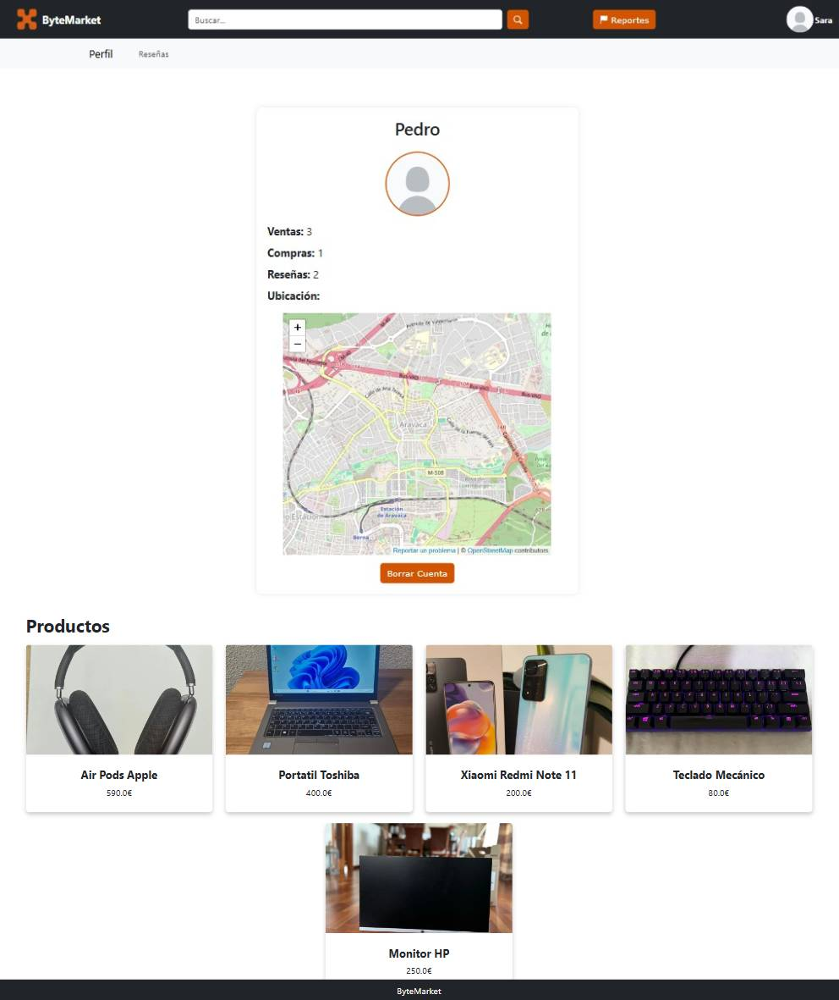

# webapp04

# 
 🔶 ByteMarket 🔶

# 📑Index
- [Phase 0](#-phase-0)
   - [Team members](#-team-members)
   - [Entities](#-entities)
   - [Types of users](#-types-of-users)
   - [User requirements](#-user-requirements)
   - [Additional Technologies](#-additional-technologies)
   - [Charts](#-charts)
   - [Advanced Algorithms](#-advanced-algorithms)
   - [Images](#-images)
- [Phase 1](#%EF%B8%8Fphase-1)
   - [Screens](#screens)

***   
# 🌀 Phase 0
***
 

## 👥 Team members
| Name  | URJC Email| GitHub nickname |
| ------------- | ------------- | ----------- |
| Olga Chubinova Bortsova | o.chubinova.2022@alumnos.urjc.es | [@chubi0l](https://github.com/chubi0l) |
| Marcos García García | m.garciaga.2022@alumnos.urjc.es  | [@marcosgrc](https://github.com/marcosgrc) |
| Naroa Martín Simón | n.martins.2022@alumnos.urjc.es  | [@NaroaMS04](https://github.com/NaroaMS04) |
| Adrián Muñoz Serrano  | a.munozse.2022@alumnos.urjc.es  | [@adri04ms](https://github.com/adri04ms) |

## 👣 Entities
- User
- Product
- Reviews
- Purchase
- Chat
  
 The entities *user* and *product* will have **images** as attributes.
 Moreover, the entitie *user* will have **saved products** as an attribute.
 
 The following diagram shows the system's entities, and how they relate to each other. 
  ##### img: Entity-Relationship Diagram
   

## ⚧️ Types of users

 - **Anonymus** : users who have not logged into a registered account. They can access basic functionalities as viewing products, searching products and filter products.
 - **Registered** :  users who have logged into a registered account. They can access a wide variety of funcionalities like buying, selling, reviewing, saving products they like and also they can message other users.
 - **Admin** :  type of user who has control over the platform, having the most extensive permissions. They are also allowed to ban usual users if they use offensive language or they publish explicit content.
   
## 🔎 User requirements

| Requierement | Anonymus| Registered | Admin |
| ------------- | ------------- | ----------- | --------- |
|   View products  | 
 ☑️ 
 | 
 ☑️ 
 | 
 ☑️ 
  |
|   Search product  | 
 ☑️ 
 | 
 ☑️ 
 | 
 ☑️ 
  |
|   View product details  | 
 ☑️ 
 | 
 ☑️ 
 | 
 ☑️ 
  |
|   View profile information (registered users)  | 
 ☑️ 
 | 
 ☑️ 
 | 
 ☑️ 
  |
|   Create reviews  | | 
 ☑️ 
  | |
|   Save product  | | 
 ☑️ 
  | |
|   Buy product  | | 
 ☑️ 
  | |
|   Sell product  | | 
 ☑️ 
  | |
|   Message seller  | | 
 ☑️ 
  | |
|   Modify profile information  | | 
 ☑️ 
  | |
|   Modify product details  | | 
 ☑️ 
  | |
|   Delete own product  | | 
 ☑️ 
  | |
|   View graphics  | | 
 ☑️ 
  |  |
|   Delete products (from other users)  | | | 
 ☑️ 
  |
|   Delete reviews (from other users)  | | | 
 ☑️ 
  |
|   Delete users  | | | 
 ☑️ 
  |

## 🖱️ Additional Technologies
- **Email**: users will receive emails when their favorite product is sold.
-  **Google Maps**: users could use this aplication to locate the address of the seller (to see if the transportation management is suits them).
  
## 📊 Charts
- **Personal sell chart**: users will be able to visualize a sell chart of the products they have selled throughout the year.
- **Personal buy chart**: users will be able to visualize a buy chart of the products they have buyed throughout the year.

## ⚙️ Advanced algorithms
- **Recommend by best seller**: This algorithm will choose the products to be featured in a registered user's home page based on higher-rated seller first.

## 🎯 Images
-  **User profile**: allow users to upload an image to their profile.
-  **Products photos**: allow users to upload images to their products.

***
# 🌀 Phase 1
***

## 🖥️ Screens

### 🏠 Home Screen
This screen will show to whoever the access to webpage. This image represents the anonymus user's header (depending on the user, the header will change), from which you can either login or sign up. Also, any user have access to view the details of the products. 
Everybody has the same access to all products, only the header changes.
| User | Admin | Anonymous |
| :----: | :------: | :------: |
|  |  |  |

###  🔍 Searcher Screen
All type of users can search products, only the header will change.
| Product exists | No product |
| :----: | :------: |
|  |  | 

###  📂 Category filter Screen
All type of users can search products, only the header will change.
 

###  🎮 Product detail Screen
Screen showing information about the product for sale (price, description) and the user selling it. It also offers the possibility to add the product to favorites or chat with the seller. If the user has purchased from this seller before, they will have the additional options to post a review or a report the seller.

#### Product detail of other user 
Users could add to "favorite" to save this product or could contact with the seller to ask questions about the product.
The admin could only eliminate the product.
Everybody can see the seller profile throughout the profile photo.
| User | Admin | Anonymous |
| :----: | :------: | :------: |
|  |  |  |

#### Product detail of buyed product (user) 

#### Product detail of own product 

###  👨‍💻 Login/Sign up Screen
Depending on whether the user is registered or not, one of the two screens will be displayed. The login screen is shown only to registered users and in case they are not registered, the registration screen will be shown.

###  ✉️ Chat Screen
If a buyer wants to ask the seller some questions about the product, they will chat together. The buyer should talk with the seller to the seller be able to sell the product.

###  🚫 Reports Screen
Admin users can manage the reports from this screen.

###  👤 Profile Screen
All type of users can see other profiles. But only registered users and admins will be able to see their own profiles. 

#### Profile of other user 
| User | Admin | Anonymous |
| :----: | :------: | :------: |
|  |  |  |

#### Own profile 
| User | Admin |
| :----: | :------: |
|  |  | 

###  ✏️ Edit profile Screen
Some user (registered) information can be modified. This screen is only shown in the own profile of each registered user (nobody else can see it).

| User | Admin |
| :----: | :------: |
|  |  | 

###  ❤️ Favorite products Screen
The registered user will add products as favorites and they will be shown in their profile. This screen is only shown in the own profile of each registered user (nobody else can see it).

| No empty | Empty |
| :----: | :------: |
|  |  | 

###  🛒 Sell product Screen
If a registered user wants to sell a product, this screen will be shown. The user should fill all sections of the form.

| Normal | Error (no fill) |
| :----: | :------: |
|  |  |

###  ✏️ Edit product
Only the owners of the product can edit all the parameters.

###  🔍 Profile review Screen
All type of users can see the reviews of other users in their profile. Only admins will be able to eliminate users reviews.

| User | Admin | Anonymous |
| :----: | :------: | :------: |
|  |  |  |

### 📊 Sales history  Screen
The products that were sold will be shown in this screen. This screen is only shown in the own profile of each registered user (nobody else can see it).

### 📜 History purchase Screen
The purchased products will be shown in this screen. This screen is only shown in the own profile of each registered user (nobody else can see it).

 
### 📺 Screens Flowchart
For simplicity, the arrows pointing to the "Favorites," "Sell," and "Chat" pages have been omitted since the navigation bar remains the same.
All options under "View Profile," such as history, favorites, and account editing, are private. This means they are only visible from your own account and cannot be accessed when viewing other users' profiles.

- ⚪️ For Anonymous Users
- 🟢 For Registered Users
- 🟠 All type of Users
- 🔵 Administrator    
 
 

 ***   
# 🌀 Phase 2  - Web with server-generated HTML and AJAX
***

## 🛠️ Execution instructions

# 🚀 Steps 
1. Download this repository
2. Check Requirements 
3. Configure Database
4. Configure IDE
5. Run Application in the IDE
6. Go to https://localhost/8443/

# 📌 Requirements
- Java: JDK 21 → [Download](https://www.oracle.com/java/technologies/downloads/#java21)
- MySQL: v 8.0.28 (Explained in Database Configuration)
- Maven: 4.0.0
- Spring Boot 3.4.2
- IDE (explained in IDE Configuration)

# 🗄️ Database Configuration
- Download MySQL v.8.0.41
- Select default port (port 3306)
- Create a user with name `root` and password `"password"` with DB admin as user role
- Configure MySQL Server as a Windows Service
- Grant full access to the user
- Create a new Schema named `ByteMarket` in the server using MySQL Workbench

# 🛠️ IDE Configuration
- We have used Visual Studio Code
- Install Maven and Spring for your IDE

# 🔐 Sample Users
## 👑 Admin
- **Email:** sara@gmail.com
- **Password:** Password1234
  
## 👤 User
- **Email:** pedro@gmail.com
- **Password:** 12341234

## 👤 User
- **Email:** hugo@gmail.com
- **Password:** securePass456

### 👤 @user
- email: alex@gmail.com
- password: securePass1234

## 🗃️ Diagrams

### 🏛️ Database Diagram
 

### 📌 Classes and Templates Diagram
 

## ⚙️ Members Participation

### 👤 Olga Chubinova Bortsova
I was responsible for the filtering of products by categories and the search functionality. Additionally, I added AJAX to load more products on all pages except the main one. I was in charge of adding all the default initialized products. Furthermore, I developed the recommendation algorithm for the main page.

At the beginning of the project, I modified most of the templates to work with Mustache and created several models along with their controllers, service, and repository. Additionally, I fixed permission issues between user types, including editing and viewing profiles, among others.

| Commit | Description |
| :----: | :---------: |
| [1º](https://github.com/CodeURJC-DAW-2024-25/webapp04/commit/4245f60fddbd6747087313ccbeabc606873b19d7) | Filter by category and searcher with AJAX refreshing integration |
| [2º](https://github.com/CodeURJC-DAW-2024-25/webapp04/commit/d56ae86885e7ba4797e5d020725eefadb347a886) | Both navbars and profile views with user restrictions functional |
| [3º](https://github.com/CodeURJC-DAW-2024-25/webapp04/commit/ed3e581aac8d4e1f9a1adbd24f7e848faa2420ff) | Recommended products |
| [4º](https://github.com/CodeURJC-DAW-2024-25/webapp04/commit/49b4473dd69503395801ccecebb602728c9a2c80) | Templates upgraded and models created |
| [5º](https://github.com/CodeURJC-DAW-2024-25/webapp04/commit/f4a4625be3606e88a90bb10543acb94a2eedbe99) | Data base initializer products |

| File | Name |
| :----: | :---------: |
| [1º](ByteMarket/backend/src/main/java/es/grupo04/backend/controller/ProductController.java) | Product Controller |
| [2º](ByteMarket/backend/src/main/java/es/grupo04/backend/controller/ProfileController.java) | Profile Controller |
| [3º](ByteMarket/backend/src/main/java/es/grupo04/backend/service/ProductService.java) | Product Service |
| [4º](ByteMarket/backend/src/main/java/es/grupo04/backend/service/UserService.java) | User Service |
| [5º](ByteMarket/backend/src/main/java/es/grupo04/backend/repository/ProductRepository.java) | Product Repository |

### 👤 Marcos García García

| Commit | Description |
| :----: | :---------: |
| [1º](https://github.com/) | |
| [2º](https://github.com/) | |
| [3º](https://github.com/) | |
| [4º](https://github.com/) | |
| [5º](https://github.com/) | |

| File | Description |
| :----: | :---------: |
| [1º](link del archivo) | |
| [2º](link del archivo) | |
| [3º](link del archivo) | |
| [4º](link del archivo) | |
| [5º](link del archivo) | |

### 👤 Naroa Martín Simón

| Commit | Description |
| :----: | :---------: |
| [1º](https://github.com/) | |
| [2º](https://github.com/) | |
| [3º](https://github.com/) | |
| [4º](https://github.com/) | |
| [5º](https://github.com/) | |

| File | Description |
| :----: | :---------: |
| [1º](link del archivo) | |
| [2º](link del archivo) | |
| [3º](link del archivo) | |
| [4º](link del archivo) | |
| [5º](link del archivo) | |

### 👤 Adrián Muñoz Serrano

| Commit | Description |
| :----: | :---------: |
| [1º](https://github.com/) | |
| [2º](https://github.com/) | |
| [3º](https://github.com/) | |
| [4º](https://github.com/) | |
| [5º](https://github.com/) | |

| File | Description |
| :----: | :---------: |
| [1º](link del archivo) | |
| [2º](link del archivo) | |
| [3º](link del archivo) | |
| [4º](link del archivo) | |
| [5º](link del archivo) | |

# ⚙️ Posible actions to perform in the application
## Anonimous User
Any user, whether logged in the application or registered or not in the application, will have access to the following actions:
### Login
Allows users to log into the application if they have an account. Their credentials (email and password) are verified. If the accounts exists and the credentials are correct, they will log in and have access to aditional features. 

### Register
Allows users to create a new account in the application to access personalized features that will will be explained later. If there is already an account linked to the mail, it is not allowed to create a second account.

### View the main page
Any user has access and can navigate through the main page of the application. It shows the products for sale from other users of the application. In addition, the products shown at the top are products of the top rated users. 

### Search for products
The application offers two alternative methods for searching products. One method uses a navigation bar, allowing users to type and search for specific products. The other method is category-based, enabling users to browse and find products within a specific category. The navigation bar is accessible from most pages in the application, while the category-based search is only available on the main page.

### View individual products
Users can view individual products, which includes detailed information such as descriptions, images, pricing, and availability. Additionally, they can read reviews left by previous buyers, offering insights into the quality of the product and the reliability of the seller.

### View other users profile
Users can view other registered users profiles, which include details such as the number of sales, purchases, and reviews they have received. They can also browse the products listed by the user and read the reviews left about them, providing a comprehensive view of the user's reputation and offerings.

## Registered User
### Logout
Registered users can log out of their account at any time by selecting the logout option. This will securely end their session and prevent unauthorized access to their account, ensuring privacy and security. The logout option is accesible from the users profile.

### Favorites
A registered user can mark products as favorites to save items they’re interested in. This allows them to easily access these products later. If a favorite product is sold or deleted, the user will receive an email notification to inform them about the change, keeping them updated on the status of their favorite items.These favorite products can be accessed at any time through the user's profile or the "Favoritos" button included in the header.

### Sell products
Registered users can sell products by filling out a form that allows them to provide detailed information about the product. The form includes fields for product name, description, price, category, and images. Once the product is submitted, it will be listed in the marketplace for other users to browse and purchase.

### Chats
Registered users can communicate with sellers and buyers through a chat feature. This allows them to ask questions, negotiate prices, and finalize transactions. The chat interface is simple to use and accessible from the product pages or the header.

### Edit profile
Users can update their profile to change personal information, such as their name, address, profile picture, or password. This allows for easy management of account details.

### Edit products
Registered users can edit the products they have listed for sale. This feature allows them to update product details such as price, description, images, and category. 

### Delete Products
Registered useres can delete products they no longer want to sell.

### Delete Account
Registered users can delete their account. This will also delete all the unsold products, reviews and reports asociated with the deleted user.

### Purchase and Sale History 
Logged-in users have access to separate histories for both their purchases and sales. Each history includes graphical representations of sold and purchased products, providing users with a visual overview of their activity. Users can also view the products they’ve purchased or sold. Users can also access detailed information about the products they’ve purchased or sold, allowing them to explore further details as needed.

### Leave a review
Once a user has purchased a product from another, they can leave reviews for the seller. This reviews will help other buyers assess the seller's reliability and product quality. The feedback left by buyers will impact the seller's reputation and overall rating.

### Report a user
Users can report a seller directly from the product they bought(in the purchase history) if the product does not meet expectations or if there are any issues with the transaction. These reports are submitted to the administrators, who will review the situation and take appropriate action.

## Admin
### Logout
Registered users can log out of their account at any time by selecting the logout option. This will securely end their session and prevent unauthorized access to their account, ensuring privacy and security. The logout option is accesible from the users profile.

### Manage Reports
Admins can manage reports submitted by users regarding other users. They have the ability to review, investigate, and take appropriate actions based on the nature of the reports, ensuring the platform remains safe and compliant with its policies.

### Delete Account
Admins have the authority to delete other users' accounts when necessary. This action permanently removes the user's profile, including their products, reviews, and associated data, in accordance with platform guidelines and policies.

# 📈 Product Display Algorithm
The algorithm used to display recommended products on the main page works as follows:
1. **Seller Ratings Calculation**:  
   First, the algorithm calculates the average rating for each seller based on the reviews they’ve received. If a seller has no ratings, their average rating defaults to 0.

2. **Rank Products by Recency**:  
   For each seller, the products they own are ranked by their publication date. The algorithm assigns a rank to each product, starting from the most recently published, and limits the ranking to the top 3 products per seller.

3. **Filter Unsolved Products**:  
   The algorithm filters out products that have already been sold, ensuring that only unsold products are considered for display.

4. **Sort by Seller Rating and Publication Date**:  
   Once the products are ranked and filtered, they are sorted in descending order by the seller's average rating. If two products have the same rating, they are then sorted by the publication date, with the most recently published products appearing first.

5. **Final Product List**:  
   The result is a list of products where each seller’s top 3 most recent unsold products are shown, prioritized first by the seller's average rating and then by the publication date.

This approach ensures that users see highly rated products from active sellers while considering the recency of the product listings.

